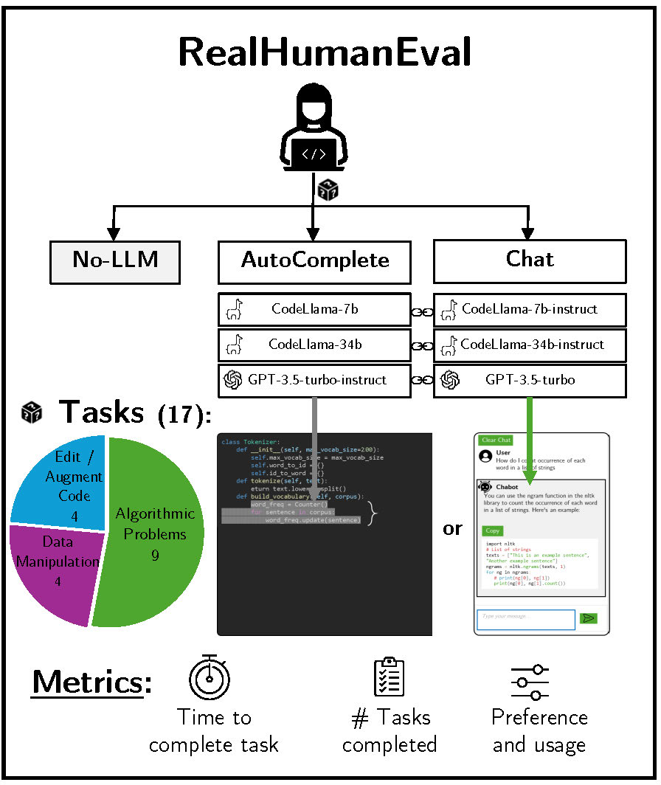
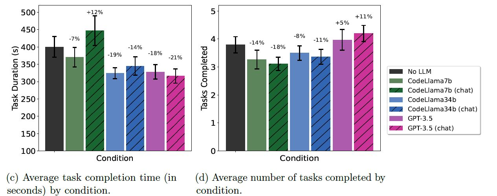

# The RealHumanEval

Associated code and data for the paper "The Real HumanEval: Evaluating Large Language Models’ Abilities to Support Programmers".





# What is it?

Coding benchmarks such as HumanEval  evaluate the ability of large language models (LLMs) to generate code that passes unit tests. 
While these benchmarks play an important role in evaluating LLMs, they do not necessarily reflect the current use of LLMs to assist programmers. 
We conduct a user study (N=213), the RealHumanEval, to measure the ability of different LLMs to support programmers in their tasks. 
We developed an online web app in which users interacted with one of six different LLMs integrated into an editor through either autocomplete support, akin to GitHub Copilot, or chat support, akin to ChatGPT, in addition to a condition with no LLM assistance. 
We measure user performance in terms of the speed and amount of tasks completed, as well as user satisfaction metrics of LLM helpfulness.
While we find general correspondence between benchmark performance and user performance (i.e., less performant models tended to slow users down and reduce the number of tasks completed), the gaps in benchmark performance are not proportional to gaps in human performance metrics.
Furthermore, benchmark performance does not translate into user perceptions of helpfulness.  
Our study also reveals that the benefits of LLM support for programming may currently be overstated; thus, we caution against over-optimizing for benchmark performance and highlight multiple avenues to improve both autocomplete and chat systems. We also hope that LLM developers evaluate the coding ability of their models with the help of our RealHumanEval platform. 

In this repository, you can find the data of participants study sessions as well as code to analyze that data.





# Data

You can find our data on Huggingface hub at [realhumaneval](https://huggingface.co/datasets/hsseinmz/realhumaneval), or for a direct download link, you can use the following link: [link](https://storage.googleapis.com/public-research-data-mozannar/realhumaneval_data.zip).

The data released consists of four parts (can also be found in the folder [./data](./data)):

- chat (chat_data.csv): contains the chat logs of the conversations between the study participants and the LLMs

- autocomplete (autocomplete_data.csv): for each suggestion shown in the autocomplete conditions, we log whether it was accepted and the prompt of the LLM

- tasks (task_data.csv): the tasks that the participants were asked to complete

- study (study_data.csv and study_data.pkl): a dataframe of processed information for each participant (e.g., how many tasks they completed, their code history, how many suggestions they accepted ...). Use the pickle version of this file for the most accurate representation of the data.


# Installation

Analysis code is in Python, you will need the following packages: pandas, numpy, matplotlib, seaborn, sklearn, statsmodels, datasets (huggingface).

# Organization

This repository is organized as follows:


- [analysis](analysis) should contain the final analysis notebooks

- [data](data) should contain the raw data used for analysis


# Paper Reproducibility 

To reproduce figures and results from the paper, you can run the following notebooks:

- Main paper analyses  [./analysis/main_analysis.ipynb](./analysis/main_analysis.ipynb)

- Appendix analyses  [./analysis/appendix_analysis.ipynb](./analysis/appendix_analysis.ipynb)

# Citation

```

```

# Acknowledgements

This work is partially funded by the MIT-IBM Watson AI Lab.

