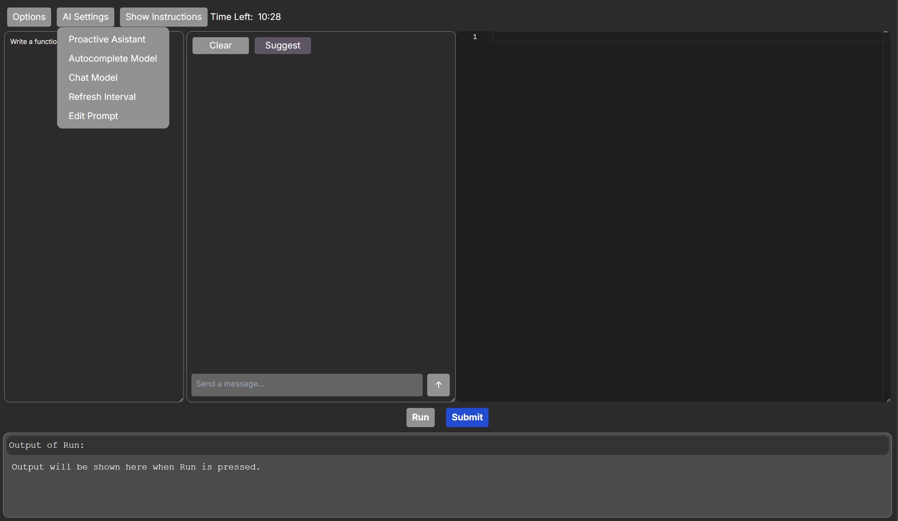
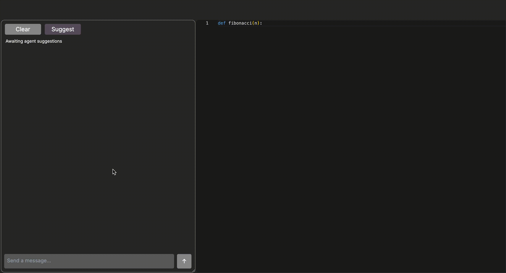

# RealHumanEval Interface

This is a local version of RealHumanEval, however, by replacing the API calls to be non-local in [app/functions/cloud_functions_helper.js](app/functions/cloud_functions_helper.js) and task loading in [app/functions/task_logic.js](app/functions/task_logic.js) and [app/page.tsx](app/page.tsx) you can host this with Firebase as we did for the actual user study.

The repo is organized as follows:

- [app](app): Contains the frontend code for the project.

- [app/components](app/components): Contains the React components for the project.

- [app/functions](app/functions): Contains the helper functions for the project.

- The main page is [app/page.tsx](app/page.tsx).

### Installation
This is a [Next.js](https://nextjs.org/) project bootstrapped with [`create-next-app`](https://github.com/vercel/next.js/tree/canary/packages/create-next-app).

Follow the instructions below to install the necessary dependencies.


```
npm install next react react-dom
npm install axios
npm install openai
```


You need to your API keys to [app/components/settings.tsx](app/components/settings.tsx) file. For now this is well tested with OpenAI API and OneCompiler API. 


First, run the development server:

```bash
npm run dev
# or
yarn dev
# or
pnpm dev
# or
bun dev
```

Open [http://localhost:3000](http://localhost:3000) with your browser to see the result.

This is what you will see:




